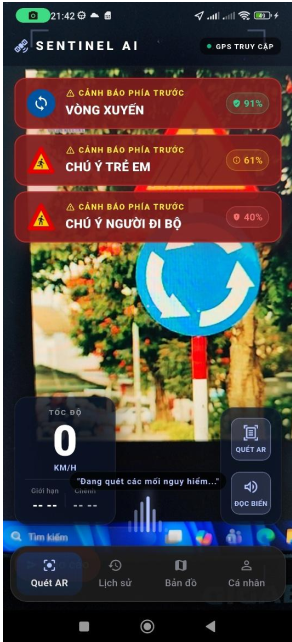
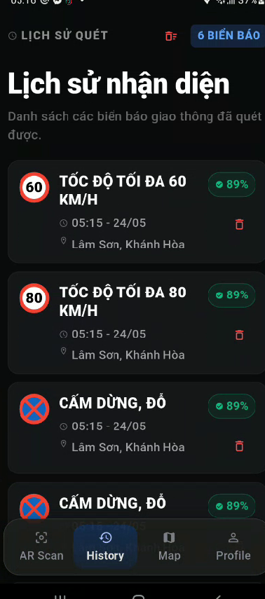
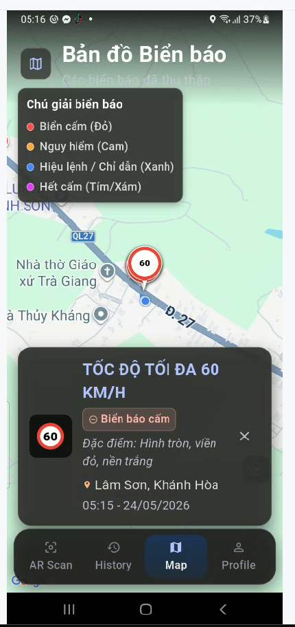
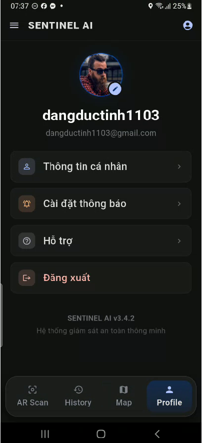

# 🚦 Traffic Sign Detection - Admin Portal
📱 **Giới thiệu**
**Traffic Sign Detection Admin Portal** là hệ thống quản lý và trực quan hóa dữ liệu toàn diện dành cho mô hình AI nhận diện biển báo giao thông. Hệ thống bao gồm một Backend mạnh mẽ xử lý dữ liệu không gian (Geospatial data) và một ứng dụng Dashboard đa nền tảng giúp quản trị viên theo dõi, phân tích và quản lý vị trí các biển báo trên bản đồ số theo thời gian thực.
✨ **Tính năng chính**
- **🗺️ Trực quan hóa Bản đồ (Interactive Map):** Hiển thị vị trí tọa độ của các biển báo giao thông được AI phát hiện trực tiếp lên bản đồ số.
- **🎯 Xử lý Dữ liệu Không gian (Geospatial Clustering):** Tự động gom cụm (DBSCAN) và loại bỏ các tọa độ biển báo bị trùng lặp trong cùng một khu vực bằng thuật toán PostGIS.
- **📊 Báo cáo & Thống kê:** Cung cấp biểu đồ trực quan về tần suất, loại biển báo và mật độ phân bố tại các khu vực.
- **🔒 Quản lý Truy cập:** Hệ thống phân quyền an toàn với JWT Authentication và bảo mật API.
- **📱 Đa nền tảng:** Giao diện quản trị viên (Admin Dashboard) hoạt động mượt mà trên Web, Desktop và Mobile.
  
### 📱 **Giao diện ứng dụng**
<p align="center">
  
  
  
  
</p>
🛠️ **Công nghệ sử dụng**
**Frontend (Admin Dashboard):**
- **Framework:** Flutter
- **Ngôn ngữ:** Dart
- **Bản đồ (Mapping):** flutter_map, latlong2
- **Biểu đồ (Charts):** fl_chart
- **UI Components:** data_table_2, Material Design
- **BaaS Client:** supabase_flutter
**Backend & Database:**
- **Framework:** NestJS (Node.js)
- **Ngôn ngữ:** TypeScript
- **Cơ sở dữ liệu:** PostgreSQL (trên nền tảng Supabase)
- **Xử lý Không gian (GIS):** PostGIS (sử dụng DBSCAN clustering)
- **Bảo mật:** JWT, Passport, Helmet
- **Tài liệu API:** Swagger/OpenAPI
📲 **Hướng dẫn cài đặt**
### 1. Khởi chạy Backend (NestJS)
```bash
# Clone repository
git clone https://github.com/Tinhdang-AI/Traffic-sign-yolo.git
cd Traffic-sign-yolo/sentinel-backend
# Cài đặt dependencies
npm install
# Thiết lập biến môi trường
cp .env.example .env 
# (Nhập các thông tin kết nối Supabase và JWT secret vào file .env)
# Chạy server ở chế độ dev
npm run start:dev
### 2. Khởi chạy Frontend (Flutter)
# Di chuyển vào thư mục admin dashboard
cd ../admin_traffic
# Cài đặt các package
flutter pub get
# Chạy ứng dụng (Web, Android, hoặc iOS)
flutter run -d chrome
