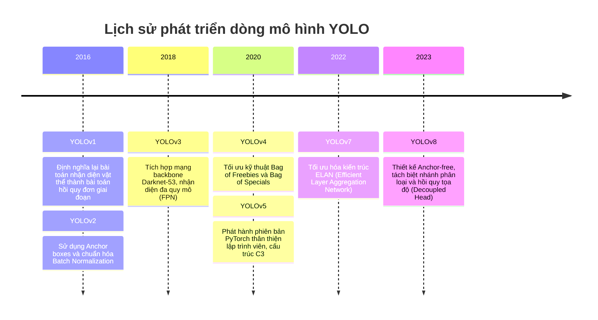
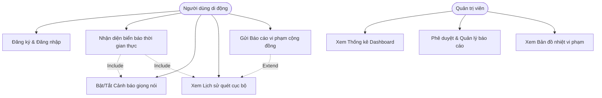
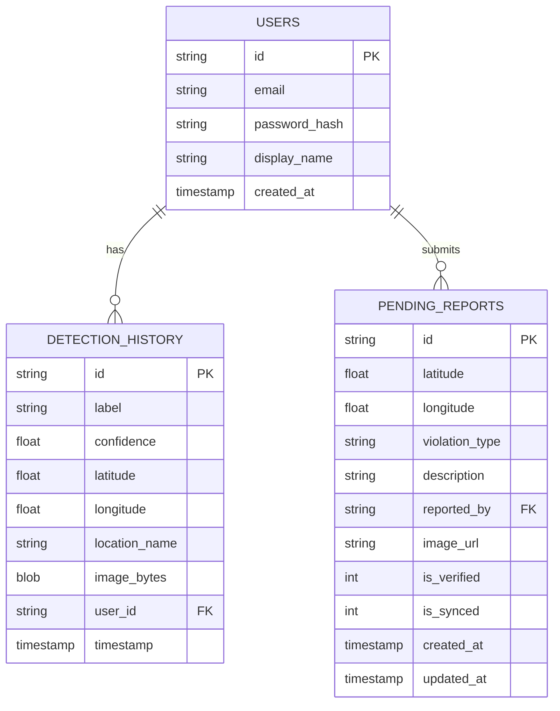
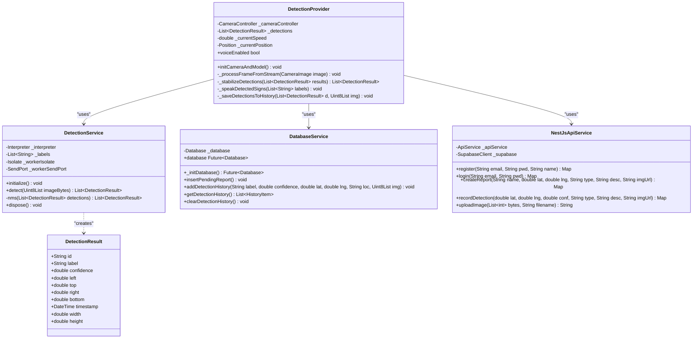
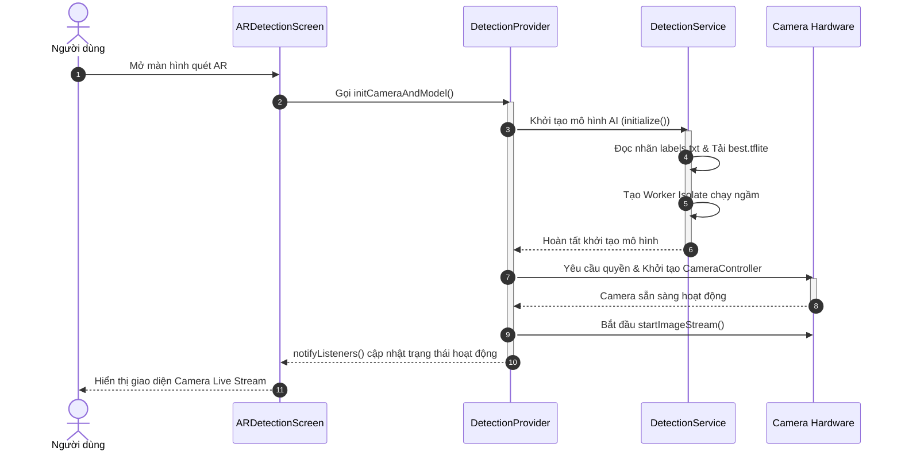
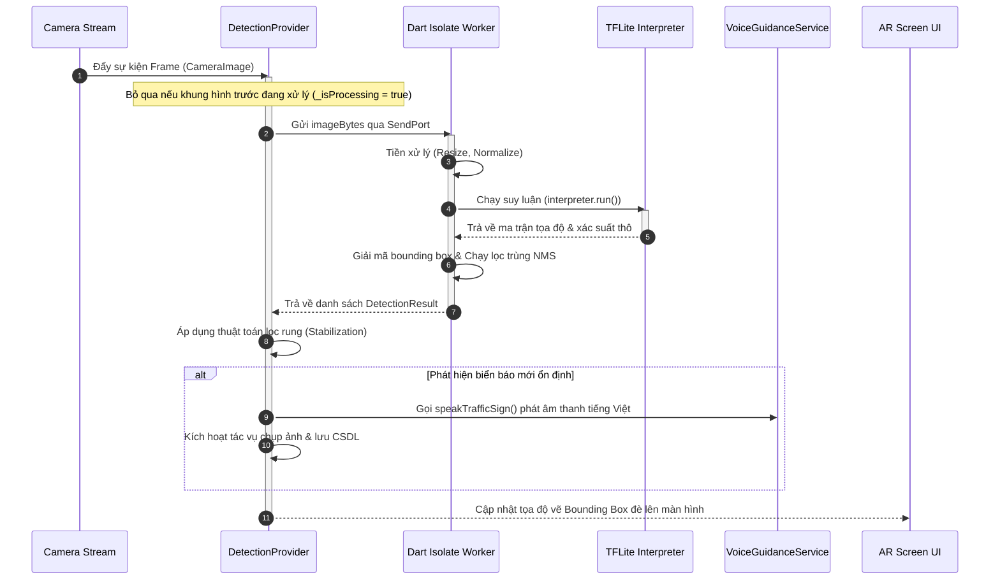
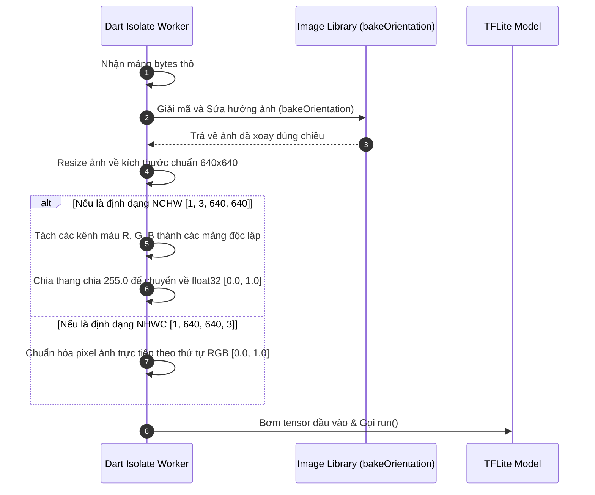
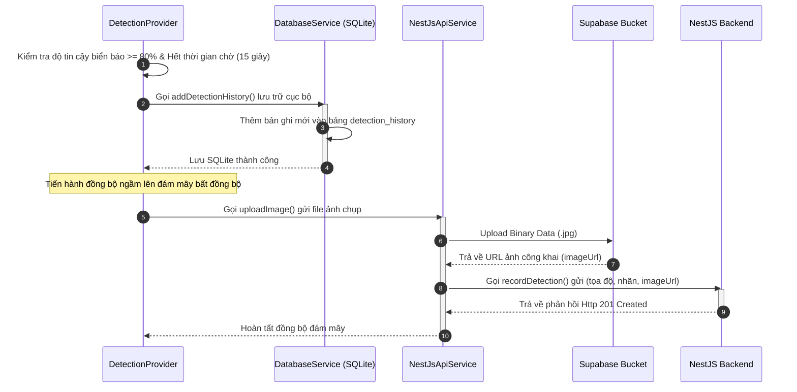
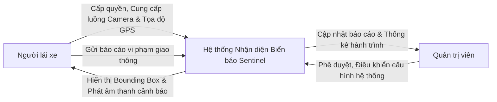
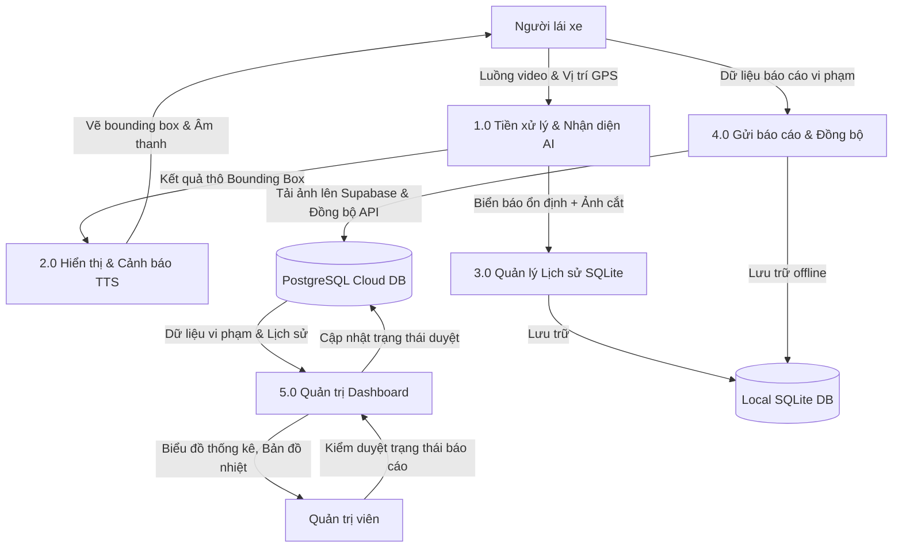

# TRƯỜNG ĐẠI HỌC GIAO THÔNG VẬN TẢI TP. HỒ CHÍ MINH
## VIỆN CÔNG NGHỆ THÔNG TIN VÀ ĐIỆN, ĐIỆN TỬ

***

# XÂY DỰNG ỨNG DỤNG NHẬN DIỆN BIỂN BÁO GIAO THÔNG PHỤC VỤ PHÁT TRIỂN CỘNG ĐỒNG
## BÁO CÁO KHÓA LUẬN TỐT NGHIỆP

**NGÀNH:** CÔNG NGHỆ THÔNG TIN  
**CHUYÊN NGÀNH:** CÔNG NGHỆ THÔNG TIN  

**Người hướng dẫn:** TS. ĐẶNG NHÂN CÁCH  
**Sinh viên thực hiện:**  
ĐẶNG ĐỨC TĨNH  
LÊ ĐÀO KHANG THỊNH  

*TP. HỒ CHÍ MINH – Tháng 06, Năm 2026*

***

## LỜI CAM ĐOAN

Chúng em xin cam đoan đề tài khóa luận tốt nghiệp: *“Xây dựng ứng dụng nhận diện biển báo giao thông phục vụ phát triển cộng đồng”* là kết quả làm việc nhóm của chúng em dưới sự chỉ dẫn của TS. Đặng Nhân Cách.

Các nội dung trình bày trong khóa luận, bao gồm từ khâu phân tích yêu cầu, thiết kế hệ thống đến triển khai mã nguồn và đánh giá kết quả, đều là kết quả nghiên cứu chung của nhóm. Những phần tham khảo từ các tài liệu khác đều được chúng em liệt kê rõ ràng trong mục Tài liệu tham khảo. Chúng em xin cam đoan không sao chép nguyên văn hay sử dụng kết quả của người khác để làm kết quả của nhóm mình.

Chúng em xin chịu trách nhiệm về nội dung cam đoan trên.

*TP.HCM, ngày 01 tháng 05 năm 2026*  
**Nhóm thực hiện**  
Đặng Đức Tĩnh và Lê Đào Khang Thịnh  

***

## MỤC LỤC
1. [CHƯƠNG 1: TỔNG QUAN VỀ ĐỀ TÀI](#chuong-1-tong-quan-ve-de-tai)
   - 1.1. Giới thiệu chung và đặt vấn đề
   - 1.2. Tổng hợp và phân tích các nghiên cứu liên quan
   - 1.3. So sánh và chỉ ra những hạn chế của các giải pháp trước đây
   - 1.4. Tính cấp thiết và tính ưu việt của hướng tiếp cận "YOLOv8 + Flutter"
   - 1.5. Mục tiêu đề tài
   - 1.6. Phân tích yêu cầu chức năng hệ thống
   - 1.7. Phân tích yêu cầu phi chức năng
2. [CHƯƠNG 2: GIẢI PHÁP ĐỀ XUẤT](#chuong-2-giai-phap-de-xuat)
   - 2.1. Cơ sở lý thuyết
   - 2.2. Lịch sử phát triển và Kiến trúc mạng nơ-ron của YOLOv8
   - 2.3. Phương pháp/chỉ tiêu đánh giá
   - 2.4. Kết quả dự kiến của đề tài
3. [CHƯƠNG 3: PHÂN TÍCH VÀ THIẾT KẾ HỆ THỐNG](#chuong-3-phan-tich-va-thiet-ke-he-thong)
   - 3.1. Phân tích chức năng và Biểu đồ Use Case
   - 3.2. Thiết kế hệ thống
   - 3.3. Các biểu đồ trình tự của hệ thống (Sequence Diagrams)
   - 3.4. Sơ đồ luồng dữ liệu (Data Flow Diagram - DFD)
4. [CHƯƠNG 4: KIỂM THỬ VÀ CÀI ĐẶT](#chuong-4-kiem-thu-va-cai-dat)
   - 4.1. Môi trường phát triển và Cài đặt
   - 4.2. Triển khai các phân hệ (Deployment)
   - 4.3. Quá trình tiền xử lý và cấu trúc tập dữ liệu (Dataset Processing)
   - 4.4. Kịch bản kiểm thử hệ thống (System Test Cases)
5. [CHƯƠNG 5: KẾT QUẢ, KẾT LUẬN VÀ HƯỚNG PHÁT TRIỂN](#chuong-5-ket-qua-ket-luan-va-huong-phat-trien)
   - 5.1. Kết quả đạt được
   - 5.2. Những khó khăn và hạn chế còn tồn tại
   - 5.3. Đề xuất định hướng phát triển trong tương lai
6. [TÀI LIỆU THAM KHẢO](#tai-lieu-tham-khao)

***

## CHƯƠNG 1: TỔNG QUAN VỀ ĐỀ TÀI

### 1.1. Giới thiệu chung và đặt vấn đề
Trong bối cảnh đô thị hóa và sự phát triển mạnh mẽ của hệ thống giao thông thông minh (Intelligent Transportation Systems - ITS), các biển báo giao thông đóng vai trò như một "ngôn ngữ không lời" thiết yếu trên đường. Chúng cung cấp các thông tin quy định, giới hạn tốc độ, cảnh báo nguy hiểm và điều tiết hành vi của người tham gia giao thông. Việc nhận diện chính xác và tuân thủ các biển báo không chỉ đảm bảo lưu thông trơn tru mà còn là thành phần cốt lõi của các Hệ thống Hỗ trợ Người lái Tiên tiến (ADAS) và Xe tự hành (AVs) nhằm giảm thiểu tối đa tai nạn.

Tại Việt Nam, sự gia tăng nhanh chóng của các phương tiện giao thông cá nhân đang tạo ra áp lực khổng lồ lên hạ tầng cơ sở. Mặc dù hệ thống biển báo đường bộ đã được quy chuẩn hóa thống nhất (tiêu biểu như theo QCVN 41:2019/BGTVT), trên thực tế, nhiều vụ tai nạn vẫn xảy ra do người điều khiển phương tiện thiếu chú ý, bị phân tâm, hoặc không kịp nhận biết biển báo trong các điều kiện môi trường bất lợi như ban đêm, thời tiết xấu, tầm nhìn bị che khuất hay khi di chuyển với tốc độ cao. Từ thực trạng đó, việc ứng dụng công nghệ thị giác máy tính để tự động hóa Bài toán Nhận diện và Phân loại Biển báo Giao thông (TSDR - Traffic Sign Detection and Recognition) nhằm cảnh báo sớm cho tài xế là một nhu cầu vô cùng cấp thiết, mang ý nghĩa thực tiễn to lớn.

Mặc dù vậy, các phương pháp nhận diện truyền thống dựa trên việc trích xuất đặc trưng thủ công (như màu sắc, hình dáng) thường tỏ ra kém hiệu quả trước những biến đổi phức tạp của bối cảnh đường phố thực tế và khó đáp ứng được yêu cầu khắt khe về thời gian xử lý. Song song với đó, một thách thức công nghệ lớn đặt ra là làm thế nào để đưa các mô hình Trí tuệ Nhân tạo (AI) phức tạp xuống chạy trực tiếp trên các thiết bị di động của người dùng (on-device machine learning) để hỗ trợ liên tục. Việc chạy mô hình offline trực tiếp trên thiết bị giúp loại bỏ độ trễ do phụ thuộc vào đường truyền mạng Internet, đảm bảo khả năng cảnh báo thời gian thực (real-time) và tăng cường bảo vệ quyền riêng tư dữ liệu.

Để giải quyết trọn vẹn bài toán trên, sự kết hợp giữa mô hình học sâu YOLOv8 và framework phát triển ứng dụng Flutter nổi lên như một giải pháp công nghệ tối ưu. Thứ nhất, trong lĩnh vực phát hiện vật thể, mạng nơ-ron tích chập (CNN) và đặc biệt là họ mô hình YOLO (You Only Look Once) đã mang lại bước đột phá nhờ khả năng đánh giá toàn bộ hình ảnh và dự đoán đồng thời trong một lần chạy duy nhất. Phiên bản YOLOv8 là một trong những kiến trúc tiên tiến nhất hiện nay, cung cấp sự cân bằng xuất sắc giữa độ chính xác nhận diện và tốc độ khung hình/giây (FPS), rất lý tưởng để tối ưu hóa trên các thiết bị có tài nguyên phần cứng hạn chế. Thứ hai, việc xây dựng một ứng dụng di động là hướng tiếp cận dễ dàng tiếp cận đại đa số người lái xe. Flutter là một bộ công cụ phát triển giao diện (UI framework) đa nền tảng hiện đại, cho phép biên dịch trực tiếp sang mã máy tự nhiên (native machine code), từ đó mang lại hiệu năng cao tương đương ứng dụng bản địa. Kiến trúc của Flutter hỗ trợ tích hợp liền mạch các mô hình học máy (như TensorFlow Lite), cho phép ứng dụng truy xuất luồng video trực tiếp từ camera, quét và vẽ các khung nhận diện biển báo ngay trên màn hình theo thời gian thực.

Xuất phát từ những cơ sở khoa học và thực tiễn nêu trên, đề tài "Ứng dụng di động nhận diện biển báo giao thông thời gian thực sử dụng Flutter và YOLOv8" được lựa chọn nghiên cứu. Đề tài kỳ vọng xây dựng thành công một hệ thống trọn vẹn, chạy mượt mà trên thiết bị di động cá nhân, qua đó cung cấp một công cụ đắc lực hỗ trợ người lái xe và góp phần nâng cao văn hóa cũng như an toàn giao thông.

### 1.2. Tổng hợp và phân tích các nghiên cứu liên quan
Bài toán Nhận diện và Phân loại Biển báo Giao thông (TSDR) đã trải qua nhiều giai đoạn phát triển với các phương pháp tiếp cận khác nhau:
- **Phương pháp truyền thống (Dựa trên màu sắc, hình dáng và Học máy cơ bản):** Các nghiên cứu trước đây thường sử dụng ngưỡng màu (như không gian màu HSV, HSI) kết hợp với các thuật toán trích xuất đặc trưng thủ công như HOG, LBP, Gabor, SIFT. Sau đó, các bộ phân loại như Support Vector Machines (SVM) hoặc Random Forests (RF) được sử dụng để nhận diện. Một số hệ thống sử dụng Random Forests kết hợp đặc trưng HOG và LSS đạt độ chính xác khoảng 96%, nhưng tốc độ xử lý chỉ dừng ở mức 8-10 khung hình/giây (fps).
- **Phương pháp sử dụng mạng nơ-ron tích chập (CNN) truyền thống:** Sự ra đời của Deep Learning đã thay thế việc trích xuất đặc trưng thủ công bằng các mạng CNN tự động học đặc trưng từ dữ liệu. Các mô hình phát hiện đối tượng hai giai đoạn (two-stage detectors) như R-CNN, Fast R-CNN, và Faster R-CNN đã cải thiện độ chính xác đáng kể. Tuy nhiên, các mô hình này sử dụng các thuật toán đề xuất vùng (như Selective Search) rất tốn kém tài nguyên; ví dụ, R-CNN mất tới 40 giây cho mỗi bức ảnh, trong khi Fast R-CNN mất khoảng 0.3 đến 2 giây, không thể đáp ứng yêu cầu thời gian thực. Ngoài ra, các phương pháp đề xuất vùng này thường hoạt động rất kém đối với các vật thể có kích thước cực nhỏ như biển báo giao thông (thường chiếm chưa tới 1% diện tích bức ảnh).
- **Các phiên bản YOLO trước đây (YOLOv1 - YOLOv7):** Họ thuật toán YOLO (You Only Look Once) đã thay đổi tư duy bằng cách chuyển bài toán phát hiện thành một bài toán hồi quy duy nhất (single-stage), giúp tăng tốc độ lên mức thời gian thực (real-time). Tuy nhiên, phiên bản YOLOv1 gặp hạn chế lớn trong việc định vị chính xác các vật thể nhỏ do các ràng buộc không gian. Mặc dù các phiên bản YOLOv5, YOLOv6 và YOLOv7 sau này đã cải thiện đáng kể cả về tốc độ lẫn độ chính xác, nhưng YOLOv8 vẫn cho thấy hiệu năng vượt trội hơn hẳn. Thử nghiệm trên tập dữ liệu COCO cho thấy YOLOv8 đạt chỉ số mAP50-95 cao nhất (ví dụ YOLOv8 đạt 53.9 mAP so với các thế hệ trước).

### 1.3. So sánh và chỉ ra những hạn chế của các giải pháp trước đây
Khi đối chiếu các phương pháp cũ với hướng tiếp cận YOLOv8 triển khai trên nền tảng di động, ta có thể thấy rõ những hạn chế chí mạng của các giải pháp trước đây:
1. **Độ trễ cao và chi phí tính toán lớn:** Các mạng CNN truyền thống như Faster R-CNN tuy chính xác nhưng có độ trễ cao và đòi hỏi tài nguyên tính toán lớn (GPU mạnh), khiến việc đưa chúng xuống chạy trực tiếp trên thiết bị di động (on-device) là bất khả thi.
2. **Dễ bị nhiễu bởi môi trường thực tế:** Các phương pháp học máy truyền thống (SVM, RF) phụ thuộc quá nhiều vào trích xuất màu sắc và hình dáng thủ công. Chúng rất dễ bị đánh lừa bởi điều kiện thời tiết xấu, ánh sáng yếu ban đêm, hoặc biển báo bị che khuất một phần.
3. **Điểm yếu với các đối tượng kích thước nhỏ (Small Objects):** Biển báo giao thông khi nhìn từ xa thường chiếm diện tích rất nhỏ. Các mô hình như SSD hay các phiên bản YOLO cũ thường bỏ sót hoặc nhận diện sai các mục tiêu nhỏ này.
4. **Khó khăn trong triển khai đa nền tảng (Cross-platform Deployment):** Việc đóng gói các mô hình AI phức tạp thành một ứng dụng hoàn chỉnh cho cả Android và iOS trước đây đòi hỏi viết mã gốc (native code) riêng biệt bằng Java/Kotlin và Swift. Quá trình này tạo ra rào cản lớn do hiệu suất không đồng nhất, độ trễ giao tiếp giữa các lớp UI và hệ thống nền tảng.

### 1.4. Tính cấp thiết và tính ưu việt của hướng tiếp cận "YOLOv8 + Flutter"
Từ những hạn chế trên, đề tài sử dụng YOLOv8 kết hợp framework Flutter đáp ứng hoàn hảo các yêu cầu khắt khe của hệ thống Hỗ trợ người lái (ADAS) hiện đại:
- **Tối ưu hóa thời gian thực trên thiết bị di động:** YOLOv8 sở hữu kiến trúc mạng không dùng anchor (anchor-free split Ultralytics head) giúp cân bằng hoàn hảo giữa độ chính xác và tốc độ xử lý. Quan trọng hơn, mô hình YOLOv8 có thể được lượng tử hóa và xuất sang định dạng TensorFlow Lite (TFLite). TFLite cho phép mô hình AI chạy ngoại tuyến (offline) trực tiếp trên thiết bị di động, loại bỏ hoàn toàn độ trễ mạng và bảo vệ quyền riêng tư dữ liệu.
- **Khắc phục nhược điểm nhận diện vật thể nhỏ:** YOLOv8 vượt trội hơn hẳn các thế hệ trước trong việc phát hiện đối tượng nhỏ bằng cách trích xuất các kim tự tháp đặc trưng sâu sắc và thực hiện dự đoán đa quy mô.
- **Sức mạnh của Framework Flutter:** Việc ứng dụng Flutter để xây dựng ứng dụng di động giải quyết triệt để bài toán "khó deploy đa nền tảng". Flutter là framework UI biên dịch trực tiếp sang mã máy gốc (native machine code), giúp bỏ qua các lớp trừu tượng trung gian và cung cấp hiệu năng mượt mà không kém ứng dụng native. Khả năng tích hợp dễ dàng với camera (thông qua Camera plugin) và mô hình học máy TFLite cho phép Flutter nhận luồng video liên tục và vẽ các khung nhận diện (bounding boxes) lên màn hình điện thoại với tốc độ rất cao.

### 1.5. Mục tiêu đề tài
Đề tài đặt ra hai nhóm mục tiêu cốt lõi nhằm giải quyết trọn vẹn bài toán nhận diện biển báo giao thông thời gian thực:
- **Mục tiêu nghiên cứu công nghệ AI:** Tiến hành huấn luyện và tinh chỉnh mô hình học sâu YOLOv8 trên tập dữ liệu hình ảnh biển báo giao thông Việt Nam phức tạp, hướng tới việc đạt được độ chính xác nhận diện và phân loại cao. Thực hiện chuyển đổi và lượng tử hóa (quantization) mô hình từ định dạng PyTorch gốc sang định dạng TensorFlow Lite (TFLite) gọn nhẹ (chạy định dạng Float16/Int8) nhằm tối ưu hóa bộ nhớ và tốc độ suy luận ngoại tuyến trên thiết bị di động.
- **Mục tiêu phát triển ứng dụng:** Xây dựng một ứng dụng di động hoàn chỉnh đa nền tảng bằng framework Flutter. Ứng dụng tích hợp luồng camera thời gian thực, module hậu xử lý hình ảnh (thuật toán NMS), vẽ bounding boxes, dịch nghĩa tiếng Việt trực quan, phát cảnh báo giọng nói (TTS) chống phân tâm và hỗ trợ lưu trữ cục bộ (SQLite) kèm đồng bộ hóa đám mây (NestJS/Supabase).

### 1.6. Phân tích yêu cầu chức năng hệ thống
Hệ thống được thiết kế với 4 nhóm chức năng cốt lõi:
1. **Chức năng khởi tạo và cấp quyền (Initialization & Permissions):** Kiểm tra và yêu cầu quyền truy cập phần cứng camera, GPS từ hệ điều hành. Nạp song song tệp mô hình `.tflite` từ thư mục assets vào bộ nhớ RAM thiết bị thông qua `DetectionService`.
2. **Chức năng nhận diện thời gian thực (Real-time Detection):** Nhận luồng video từ camera ở định dạng thô, thực hiện tiền xử lý (resize về $640 \times 640$, chuẩn hóa giá trị pixel), suy luận (inference) qua bộ thông dịch TFLite để dự đoán lớp và tọa độ biển báo.
3. **Chức năng hiển thị kết quả và cảnh báo trực quan:** Áp dụng thuật toán Non-Maximum Suppression (NMS) để lọc các khung bao chồng chéo. Chuyển đổi ID lớp thành tên biển báo tiếng Việt/tiếng Anh, vẽ khung bao thời gian thực đè lên UI camera và phát cảnh báo âm thanh thông qua Text-to-Speech (TTS).
4. **Chức năng quản lý lịch sử nhận diện (Detection History Management):** Lưu trữ cục bộ dữ liệu nhận diện ổn định (confidence $\ge 0.65$) bao gồm: nhãn, tọa độ GPS, thời gian quét và hình ảnh chụp cắt biển báo. Đồng thời đồng bộ dữ liệu này lên hệ thống Cloud (NestJS/Supabase) khi thiết bị kết nối Internet.

### 1.7. Phân tích yêu cầu phi chức năng
- **Hiệu năng và thời gian thực:** Tốc độ xử lý khung hình đạt từ 20-30 FPS để hiển thị mượt mà trên UI. Độ trễ suy luận của mô hình AI trên mỗi khung hình phải dưới 50ms trên các thiết bị di động tầm trung.
- **Tối ưu hóa tài nguyên:** Giới hạn kích thước mô hình dưới 20MB. Đảm bảo tiêu thụ ít năng lượng, giảm tải cho CPU thông qua cơ chế Isolate đa luồng của Dart nhằm ngăn ngừa quá nhiệt điện thoại.
- **Khả năng hoạt động độc lập (Offline Capability):** Hoạt động hoàn toàn không cần kết nối mạng trong quá trình quét biển báo và cảnh báo để đảm bảo an toàn tại các khu vực mất sóng.
- **Bảo mật và riêng tư:** Dữ liệu cá nhân, hình ảnh hành trình chỉ được lưu trữ cục bộ hoặc đồng bộ mã hóa bảo mật khi người dùng đăng nhập tài khoản.

***

## CHƯƠNG 2: GIẢI PHÁP ĐỀ XUẤT

### 2.1. Cơ sở lý thuyết

#### 2.1.1. Cơ sở lý thuyết về framework Flutter và kiến trúc Widget
Flutter là một bộ công cụ phát triển giao diện (UI toolkit) đa nền tảng, được biên dịch trực tiếp sang mã máy (machine code) như Intel x64, ARM, giúp ứng dụng đạt hiệu năng cao trên các hệ điều hành iOS và Android. Flutter tự kết xuất (render) giao diện thông qua công cụ đồ họa riêng (Skia/Impeller) thay vì sử dụng view hệ điều hành gốc. Flutter hoạt động dựa trên mô hình UI khai báo, phản ứng (reactive, declarative UI), trong đó giao diện được tách rời khỏi trạng thái (state) và tự động cập nhật khi trạng thái thay đổi.
Widget là thành phần cốt lõi tạo nên Flutter. Kiến trúc Widget được chia thành hai loại chính:
- **StatelessWidget:** Là các widget không chứa trạng thái thay đổi theo thời gian, phù hợp cho các thành phần tĩnh.
- **StatefulWidget:** Dành cho các thành phần cần thay đổi đặc tính dựa trên tương tác người dùng hoặc dữ liệu nhận được. Trạng thái (mutable state) được lưu trữ ở đối tượng `State` riêng biệt, giao diện được cập nhật thông qua hàm `setState()`.

#### 2.1.2. Cơ chế tích hợp mô hình học máy lên thiết bị di động (Edge AI) thông qua TFLite
Việc triển khai mô hình học sâu lên thiết bị di động đòi hỏi phải giải quyết các hạn chế về tài nguyên tính toán và bộ nhớ. TensorFlow Lite (TFLite) là giải pháp học sâu mã nguồn mở được thiết kế tối ưu hóa riêng cho thiết bị biên (edge devices).
Quá trình tích hợp diễn ra như sau:
1. **Tối ưu hóa mô hình:** Mô hình YOLOv8 sau khi huấn luyện sẽ được chuyển đổi và xuất sang định dạng `.tflite`. Thông qua các kỹ thuật lượng tử hóa (quantization - như FP16 hoặc INT8), kích thước mô hình được thu nhỏ đáng kể (khoảng 4-6 lần) và tốc độ suy luận (inference speed) được gia tăng, phù hợp với bộ nhớ của thiết bị nhúng.
2. **Hoạt động ngoại tuyến (Offline Execution):** Việc đưa mô hình AI chạy trực tiếp trên thiết bị giúp hệ thống tự chủ hoàn toàn trong việc tính toán mà không cần phụ thuộc vào đường truyền mạng Internet, từ đó triệt tiêu độ trễ (latency), đáp ứng yêu cầu xử lý thời gian thực và đảm bảo tính bảo mật của dữ liệu.

#### 2.1.3. Các Hàm mất mát (Loss Functions) trong YOLOv8 và Thiết kế Anchor-free
Để vượt qua những hạn chế của các thế hệ tiền nhiệm, YOLOv8 áp dụng thiết kế đầu dự đoán tách biệt không sử dụng hộp neo (anchor-free split head). Kiến trúc này loại bỏ sự phụ thuộc vào các hộp neo (anchor boxes) được định nghĩa sẵn, giúp giảm thiểu độ phức tạp tính toán và tăng cường tính linh hoạt khi nhận diện các vật thể có kích thước đa dạng. Thay vì sử dụng một nhánh chung, YOLOv8 tách rời quá trình dự đoán thành hai nhánh độc lập: nhánh phân loại (classification) và nhánh định vị tọa độ (localization/bounding box regression).

Trong quá trình huấn luyện, việc đánh giá và tối ưu hóa sai số giữa dự đoán của mô hình và nhãn thực tế (ground truth) được thực hiện thông qua một hàm mất mát (loss function) tổng hợp:

##### 1. Hàm mất mát phân loại (Classification Loss - cls_loss)
Nhánh phân loại sử dụng hàm Binary Cross-Entropy (BCE). Hàm BCE đo lường sự sai lệch giữa xác suất dự đoán của mô hình và nhãn thực tế cho từng lớp đối tượng độc lập:
$$\mathcal{L}_{cls} = -\frac{1}{N}\sum_{i=1}^N \left[ y_i \log(\hat{y}_i) + (1 - y_i)\log(1 - \hat{y}_i) \right]$$
Việc áp dụng BCE cho phép mô hình đánh giá xác suất xuất hiện của từng loại biển báo một cách độc lập, giúp mạng nơ-ron học được các đặc trưng vi tế giữa các lớp biển báo có hình dáng tương đồng.

##### 2. Hàm mất mát hồi quy hộp giới hạn (Bounding Box Regression Loss)
Việc xác định chính xác vị trí của biển báo được tối ưu thông qua sự kết hợp của hai hàm mất mát: CIoU (Complete Intersection over Union) và DFL (Distribution Focal Loss).
- **Hàm mất mát CIoU:** CIoU tích hợp ba yếu tố hình học cốt lõi: diện tích giao nhau, khoảng cách Euclid giữa hai tâm của hộp giới hạn, và sự đồng nhất về tỷ lệ khung hình (aspect ratio).
  $$\mathcal{L}_{CIoU} = 1 - IoU + \frac{\rho^2(b, b^{gt})}{c^2} + \alpha v$$
  Trong đó $\rho(\cdot)$ là khoảng cách Euclid giữa tâm hai hộp giới hạn, $c$ là độ dài đường chéo của hộp bao nhỏ nhất chứa cả hai hộp, $\alpha$ là tham số cân bằng, và $v$ đo lường độ đồng nhất của tỷ lệ khung hình:
  $$v = \frac{4}{\pi^2}\left(\arctan\frac{w^{gt}}{h^{gt}} - \arctan\frac{w}{h}\right)^2$$
  Nhờ có CIoU, hàm mất mát sẽ trực tiếp tạo lực phạt (penalty) kéo tâm của hộp dự đoán tiến sát về tâm của biển báo thực tế, giúp mô hình định vị cực kỳ chính xác các biển báo nhỏ ở xa hoặc các biển báo bị che khuất một phần.
- **Vai trò của Distribution Focal Loss (DFL):** DFL xử lý độ không chắc chắn (uncertainty) của các đường viền cạnh. Thay vì cố gắng hồi quy một tọa độ pixel tuyệt đối, DFL tối ưu hóa phân phối xác suất của các vị trí cạnh liền kề:
  $$\mathcal{L}_{DFL}(P_i, P_{i+1}) = - \left[ (y_{i+1} - y)\log(P_i) + (y - y_i)\log(P_{i+1}) \right]$$
  Cơ chế này đặc biệt phát huy tác dụng khi ranh giới của biển báo bị mờ nhòe do xe di chuyển nhanh hoặc trong điều kiện sương mù, thiếu sáng.

### 2.2. Lịch sử phát triển và Kiến trúc mạng nơ-ron của YOLOv8

#### 2.2.1. Lịch sử phát triển của dòng mô hình YOLO
Bài toán nhận diện đối tượng (Object Detection) từng phụ thuộc vào các kỹ thuật quét cửa sổ trượt (sliding window) hoặc các phương pháp đề xuất vùng (Region proposals) như R-CNN. Dù họ R-CNN đạt độ chính xác cao, nhưng quy trình phức tạp và chia làm nhiều giai đoạn khiến tốc độ xử lý rất chậm, không thể đáp ứng yêu cầu thời gian thực.

Vào năm 2016, Joseph Redmon và các cộng sự đã giới thiệu YOLO (You Only Look Once), tạo ra một bước ngoặt khi tái định nghĩa bài toán nhận diện đối tượng thành một bài toán hồi quy (regression problem) duy nhất. Mô hình YOLO đánh giá toàn bộ hình ảnh trong một lần chạy mạng nơ-ron để dự đoán trực tiếp tọa độ hộp giới hạn (bounding box) và xác suất của các lớp (class probabilities). Trải qua nhiều năm, dòng mô hình YOLO liên tục được nghiên cứu và nâng cấp qua các phiên bản (YOLOv2 đến YOLOv7) nhằm tối ưu hóa sự cân bằng giữa tốc độ và độ chính xác. Phiên bản YOLOv8 là một trong những thành tựu tiên tiến nhất do Ultralytics phát hành vào tháng 1 năm 2023, mang lại hiệu năng dẫn đầu về cả tốc độ lẫn độ chính xác.



#### 2.2.2. Kiến trúc mạng nơ-ron của YOLOv8
Kiến trúc của YOLOv8 được thiết kế tối ưu, chia thành 4 thành phần chính: Input, Backbone, Neck và Head.
- **Backbone (Mạng xương sống):** Đóng vai trò trích xuất các đặc trưng từ hình ảnh đầu vào thông qua các lớp tích chập. Điểm nổi bật của YOLOv8 là sử dụng cấu trúc **C2f** (Cross Stage Partial bottleneck với 2 lớp tích chập) thay thế cho cấu trúc C3 cũ, giúp cải thiện hiệu quả lan truyền gradient và tăng tốc độ hội tụ của mạng. Lớp **SPPF** (Spatial Pyramid Pooling - Fast) được tích hợp cuối backbone để tổng hợp thông tin bối cảnh ở nhiều kích thước khác nhau mà không làm giảm tốc độ tính toán.
- **Neck (Mạng cổ):** Sử dụng cấu trúc kết hợp giữa mạng kim tự tháp đặc trưng (**FPN** - Feature Pyramid Network) và mạng tổng hợp đường dẫn (**PAN** - Path Aggregation Network). Các đặc trưng từ các lớp liền kề được ghép nối (concatenate) và đưa vào module C2f, cho phép luân chuyển và dung hợp thông tin từ trên xuống dưới và từ dưới lên trên.
- **Head (Đầu dự đoán):** Áp dụng thiết kế đầu dự đoán tách biệt không dùng anchor (**anchor-free split head**). Lớp này thực hiện việc tách rời quá trình nhận diện vị trí và phân loại đối tượng thành hai nhánh riêng biệt. Nhờ thiết kế anchor-free giúp tăng cường độ chính xác định vị và tối ưu hóa đáng kể quá trình phát hiện.

#### 2.2.3. Cơ chế Quản lý trạng thái (State Management) trong xử lý luồng Camera
Khi đối mặt với bài toán nhận diện qua luồng video trực tiếp (Camera Stream), kiến trúc `setState()` truyền thống của Flutter bộc lộ những điểm yếu nghiêm trọng. Phần cứng camera liên tục trích xuất các khung hình thô với tốc độ rất cao (đạt mức 30 FPS). Nếu ứng dụng liên tục gọi `setState()` 30 lần mỗi giây để cập nhật tọa độ của biển báo, Flutter sẽ buộc phải hủy và xây dựng lại toàn bộ cây widget con, bao gồm cả widget `CameraPreview` đang phát luồng video, gây ra hiện tượng giật lag và hao pin nghiêm trọng.

Để giải quyết triệt để nút thắt cổ chai này, hệ thống áp dụng mẫu thiết kế Quản lý trạng thái (State Management) **Provider**. Logic xử lý được phân tách hoàn toàn khỏi lớp giao diện người dùng:
1. **Tách biệt Logic (Decoupling Logic):** Quy trình nhận diện được đưa vào lớp quản lý trạng thái độc lập `DetectionProvider` kế thừa `ChangeNotifier`. Lớp này hoạt động ở chế độ background lắng nghe sự kiện luồng ảnh từ camera, gửi dữ liệu thô sang một luồng thực thi độc lập (**Isolates** của Dart) nhằm tránh block luồng chính (UI Thread). Mọi tác vụ tính toán nặng bao gồm giải mã ảnh, tiền xử lý, chạy thông dịch TFLite và thuật toán lọc NMS đều diễn ra bất đồng bộ trên Isolate.
2. **Cập nhật giao diện cục bộ (Reactive UI Update):** Khi có kết quả nhận diện ổn định, `DetectionProvider` phát ra tín hiệu `notifyListeners()`. Trên giao diện người dùng, chỉ duy nhất những widget vẽ bounding box nhỏ gọn lắng nghe trạng thái này thực hiện kết xuất lại (re-render), trong khi widget nền `CameraPreview` vẫn duy trì trạng thái tĩnh.

### 2.3. Phương pháp/chỉ tiêu đánh giá

#### 2.3.1. Chỉ tiêu đánh giá mô hình học sâu (AI Model Metrics)
Để đánh giá mô hình học sâu YOLOv8, đề tài áp dụng các hệ đo lường chuẩn dựa trên việc đối chiếu kết quả dự đoán với nhãn thực tế (ground truth):

##### 1. Precision (Độ chính xác)
Tỷ lệ giữa số lượng mẫu thực tế là dương tính trong tổng số mẫu được mô hình dự đoán là dương tính. Precision cao giúp giảm thiểu các trường hợp báo động giả (False Positive):
$$\text{Precision} = \frac{TP}{TP + FP}$$

##### 2. Recall (Độ thu hồi)
Tỷ lệ giữa số lượng mẫu được mô hình dự đoán chính xác là dương tính trên tổng số mẫu thực tế là dương tính. Recall cao phản ánh khả năng không bỏ sót các biển báo nguy hiểm trên đường đi:
$$\text{Recall} = \frac{TP}{TP + FN}$$

##### 3. F1-Score (Điểm F1)
F1-Score là trung bình điều hòa giữa Precision và Recall, phản ánh sự cân bằng và tính ổn định tổng thể của mô hình:
$$\text{F1-Score} = 2 \cdot \frac{\text{Precision} \cdot \text{Recall}}{\text{Precision} + \text{Recall}}$$

##### 4. mAP (mean Average Precision)
Chỉ số mAP là thước đo tổng quát nhất để đánh giá mô hình phát hiện vật thể. Nó được tính bằng cách lấy trung bình giá trị AP (Average Precision - diện tích dưới đường cong Precision-Recall) của tất cả các lớp biển báo giao thông:
$$\text{mAP} = \frac{1}{C} \sum_{c=1}^C AP_c$$
Trong đó:
- **mAP@0.5:** Chỉ số mAP tính tại ngưỡng IoU cố định bằng 0.5.
- **mAP@0.5:0.95:** Chỉ số mAP trung bình khi ngưỡng IoU chạy từ 0.5 đến 0.95 với bước nhảy 0.05. Đây là chỉ số khắt khe nhất để đánh giá khả năng định vị chính xác vị trí của hộp giới hạn.

#### 2.3.2. Chỉ tiêu đánh giá ứng dụng di động (Mobile Application Metrics)
Hiệu năng của ứng dụng chạy trên thiết bị di động được đo lường thông qua các chỉ số phần cứng thực tế:
- **Tốc độ khung hình (Frames Per Second - FPS):** Tốc độ kết xuất khung hình camera cùng hộp giới hạn đè lên màn hình. Mục tiêu duy trì ổn định $\ge 24$ FPS để đảm bảo trải nghiệm mượt mà không gây mỏi mắt cho người dùng.
- **Độ trễ suy luận (Inference Latency):** Thời gian bộ thông dịch TFLite xử lý một khung hình đầu vào và trả về kết quả dự đoán (mục tiêu $< 40$ ms trên các thiết bị trung bình).
- **Mức tiêu hao bộ nhớ (RAM Usage):** Dung lượng RAM mà ứng dụng chiếm dụng khi chạy tác vụ nhận diện liên tục. Yêu cầu giải phóng triệt để các đối tượng đồ họa không sử dụng nhằm ngăn chặn hiện tượng rò rỉ bộ nhớ (Memory Leak) làm sập app đột ngột.
- **Mức tiêu hao năng lượng và nhiệt độ (Power & Thermal Profiling):** Đo lường mức độ sụt giảm phần trăm pin của thiết bị sau thời gian dài sử dụng liên tục camera và chạy nhận diện, đảm bảo máy không bị quá nhiệt (nhiệt độ thiết bị $< 42^\circ\text{C}$).

### 2.4. Kết quả dự kiến của đề tài

#### 2.4.1. Về mặt mô hình Trí tuệ Nhân tạo (AI Model)
- Mô hình YOLOv8 sau huấn luyện đạt độ chính xác cao: mAP@0.5 vượt trên 88% đối với các lớp biển báo chính (biển cấm tốc độ, biển cấm rẽ, biển nguy hiểm).
- Mô hình xuất ra định dạng TFLite có kích thước nhỏ gọn (dưới 15MB cho phiên bản lượng tử hóa Float16) nhưng vẫn đảm bảo độ chính xác hao hụt không quá 1.5% so với mô hình gốc.

#### 2.4.2. Về mặt ứng dụng phần mềm (Software Application)
- Ứng dụng di động Flutter có giao diện hiện đại, đáp ứng tốt trên cả nền tảng Android và iOS.
- Luồng camera hiển thị thời gian thực mượt mà, bounding boxes vẽ bám sát chuyển động biển báo ngoài thực tế.
- Hệ thống phát âm thanh cảnh báo bằng giọng nói tiếng Việt to, rõ ràng và có khoảng trễ hợp lý (cooldown) để tránh spam gây ức chế cho lái xe.
- Hệ thống cơ sở dữ liệu SQLite cục bộ lưu lịch sử ổn định và đồng bộ hóa tự động dữ liệu lên máy chủ Web Admin thành công khi có kết nối Internet.

***

## CHƯƠNG 3: PHÂN TÍCH VÀ THIẾT KẾ HỆ THỐNG

### 3.1. Phân tích chức năng và Biểu đồ Use Case
Hệ thống gồm hai tác nhân chính: **Người dùng ứng dụng di động** (tài xế lái xe tham gia giao thông) và **Quản trị viên hệ thống** (Admin quản lý trên Web Dashboard).



### 3.2. Thiết kế hệ thống

#### 3.2.1. Kiến trúc phân tầng của ứng dụng
Ứng dụng di động được xây dựng theo mô hình kiến trúc phân tầng (Layered Architecture) rõ ràng, giúp tăng tính modular, dễ bảo trì và mở rộng code:

```mermaid
graph TD
    subgraph Tầng Giao diện (Presentation Layer)
        UI_AR[ARDetectionScreen]
        UI_History[StatsHistoryScreen]
        UI_Report[CommunityReportScreen]
        UI_Shell[MainShell]
    end

    subgraph Tầng Quản lý trạng thái (Controller / State Management)
        P_Detect[DetectionProvider]
        P_Auth[AuthProvider]
        P_Settings[SettingsProvider]
    end

    subgraph Tầng Dịch vụ (Service Layer)
        S_TFLite[DetectionService]
        S_Location[LocationService]
        S_TTS[VoiceGuidanceService]
        S_DB[DatabaseService]
        S_API[NestJsApiService]
    end

    subgraph Tầng Dữ liệu và Lưu trữ (Data Layer)
        D_SQLite[(SQLite Local DB)]
        D_Backend[(NestJS Server / PostgreSQL)]
        D_Supa[(Supabase Bucket Storage)]
    end

    %% Flows
    UI_AR --> P_Detect
    P_Detect --> S_TFLite
    P_Detect --> S_Location
    P_Detect --> S_TTS
    P_Detect --> S_DB
    P_Detect --> S_API
    S_DB --> D_SQLite
    S_API --> D_Backend
    S_API --> D_Supa
```

#### 3.2.2. ERD (Entity-Relationship Diagram)
Cơ sở dữ liệu của hệ thống được thiết kế tối ưu cho cả việc lưu trữ offline dưới thiết bị di động (SQLite) và lưu trữ tập trung đồng bộ hóa trên Cloud (PostgreSQL thông qua NestJS).



#### 3.2.3. Phân tích kỹ thuật các lớp đối tượng cốt lõi (Class Diagram Analysis)
Các lớp nghiệp vụ chính trong ứng dụng Flutter được mô tả như sau:



### 3.3. Các biểu đồ trình tự của hệ thống (Sequence Diagrams)

#### 3.3.1. Biểu đồ trình tự quy trình khởi tạo ứng dụng
Khi người dùng mở màn hình `ARDetectionScreen`, luồng khởi tạo song song được kích hoạt để cấp quyền và nạp mô hình AI:



#### 3.3.2. Biểu đồ trình tự nhận diện thời gian thực
Mỗi khung hình thu được từ camera được xử lý bất đồng bộ để phát hiện biển báo và cảnh báo lái xe:



#### 3.3.3. Biểu đồ trình tự chi tiết thuật toán xử lý hình ảnh
Chi tiết quá trình tiền xử lý chuyển đổi khung hình trước khi nạp vào mô hình AI:



#### 3.3.4. Biểu đồ trình tự quản lý lịch sử nhận diện
Quy trình lưu vết thông tin biển báo ngoại tuyến và tự động đồng bộ hóa lên máy chủ trung tâm:



### 3.4. Sơ đồ luồng dữ liệu (Data Flow Diagram - DFD)

#### 3.4.1. DFD Mức Context (Mức 0 - Mức Ngữ cảnh)
Mô tả sự tương tác thông tin tổng quát giữa hệ thống ứng dụng nhận diện và các tác nhân ngoài:



#### 3.4.2. DFD Mức 1 (Mức Phân rã tiến trình)
Chi tiết các luồng dữ liệu đi qua các tiến trình con bên trong hệ thống:



***

## CHƯƠNG 4: KIỂM THỬ VÀ CÀI ĐẶT

### 4.1. Môi trường phát triển và Cài đặt

#### 4.1.1. Môi trường huấn luyện mô hình AI (Model Training Environment)
- **Hệ điều hành:** Linux Ubuntu 22.04 LTS (trên Google Colab Pro / Server chuyên dụng).
- **Phần cứng:** GPU NVIDIA Tesla T4 / A100 (16GB - 40GB VRAM) để tăng tốc độ lan truyền ngược.
- **Thư viện chính:** PyTorch 2.1.0, Python 3.10.x, Ultralytics YOLOv8 framework, CUDA 11.8.
- **Tập dữ liệu:** Tập dữ liệu biển báo giao thông thu thập thực tế tại đường phố Việt Nam kết hợp các bộ dữ liệu chuẩn hóa quốc tế, dán nhãn theo định dạng YOLO `.txt`.

#### 4.1.2. Môi trường phát triển Máy chủ và CSDL (Backend & Database Environment)
- **Kiến trúc máy chủ:** NestJS Framework (Node.js v20.x), viết hoàn toàn bằng TypeScript.
- **Cơ sở dữ liệu đám mây:** PostgreSQL 15 quản lý qua Supabase Cloud.
- **Lưu trữ tệp tin:** Supabase Storage Bucket để lưu trữ ảnh chụp vi phạm và ảnh cắt biển báo.
- **Công cụ kiểm thử API:** Postman, Swagger UI tài liệu hóa API tự động.

#### 4.1.3. Môi trường phát triển Ứng dụng di động & Web Admin (Flutter SDK)
- **Bộ phát triển:** Flutter SDK 3.22.x, Dart 3.4.x biên dịch trực tiếp ra Native ARM code.
- **Thư viện di động chính:** 
  - `tflite_flutter` v0.10.x (bộ thông dịch TensorFlow Lite).
  - `camera` v0.10.x (quản lý phần cứng máy ảnh).
  - `geolocator` v10.x (đọc tọa độ GPS và tính toán tốc độ di chuyển thực tế).
  - `sqflite` v2.x (CSDL SQLite lưu trữ ngoại tuyến).
  - `sensors_plus` v7.0.0 (giám sát con quay hồi chuyển, gia tốc kế của điện thoại).
- **Trình biên dịch & IDE:** Android Studio (dành cho Android), Xcode 15 (dành cho iOS), VS Code.

### 4.2. Triển khai các phân hệ (Deployment)
- **Huấn luyện mô hình:** Huấn luyện mô hình YOLOv8 trên máy chủ hiệu năng cao, xuất ra file `best.onnx`, sau đó dùng thư viện `tensorflowjs` hoặc `tf-nightly` chuyển đổi sang định dạng lượng tử hóa `best.tflite` (độ chính xác Float16).
- **Đóng gói ứng dụng di động:** File cấu hình mô hình `best.tflite` và từ điển nhãn `labels.txt` được đặt trong thư mục `assets/` của ứng dụng Flutter. Ứng dụng được đóng gói thành các file cài đặt `.apk`/`.aab` (cho Android) và `.ipa` (cho iOS).
- **Triển khai Backend:** API máy chủ NestJS được deploy lên Docker Container trên nền tảng đám mây Render, kết nối an toàn với cơ sở dữ liệu Supabase PostgreSQL.

### 4.3. Quá trình tiền xử lý và cấu trúc tập dữ liệu (Dataset Processing)
Tập dữ liệu ảnh biển báo được tiền xử lý qua các bước:
1. **Lọc nhiễu & Chuẩn hóa:** Loại bỏ các ảnh mờ nhòe không rõ thông tin, xoay chỉnh hướng ảnh về góc nhìn trực diện.
2. **Resize:** Điều chỉnh kích thước toàn bộ ảnh về kích thước $640 \times 640$ pixels để khớp với lớp đầu vào của mô hình YOLOv8.
3. **Phân chia tập dữ liệu:** Chia dữ liệu theo tỷ lệ chuẩn: 70% dành cho huấn luyện (Training Set), 20% cho đánh giá (Validation Set) và 10% dành cho kiểm thử độc lập (Test Set).
4. **Tăng cường dữ liệu (Data Augmentation):** Áp dụng ngẫu nhiên các kỹ thuật xoay ảnh nhẹ, thay đổi độ sáng, độ tương phản, thêm nhiễu hạt và sương mù giả lập nhằm tăng tính thích nghi của mô hình trước điều kiện thời tiết thực tế tại Việt Nam.

### 4.4. Kịch bản kiểm thử hệ thống (System Test Cases)
Hệ thống được kiểm thử kỹ lưỡng qua các kịch bản thực tế sau:

| Mã TC | Phân hệ kiểm thử | Mô tả kịch bản kiểm thử | Kết quả mong đợi | Trạng thái |
|---|---|---|---|---|
| **TC-01** | Khởi tạo hệ thống | Mở ứng dụng lần đầu, yêu cầu quyền truy cập Camera và vị trí GPS | Xuất hiện hộp thoại cấp quyền, nạp thành công mô hình AI và hiển thị camera. | ĐẠT |
| **TC-02** | Nhận diện biển báo | Đưa camera quét qua biển báo "Cấm đi ngược chiều" ngoài thực tế | Vẽ bounding box chuẩn xác ôm sát biển báo, hiển thị nhãn tiếng Việt đạt confidence > 75%. | ĐẠT |
| **TC-03** | Cảnh báo giọng nói | Phát hiện biển báo giới hạn tốc độ tối đa 50 km/h | Phát cảnh báo bằng giọng nói tiếng Việt rõ ràng: "Phát hiện biển báo tốc độ tối đa 50 kilomet trên giờ". | ĐẠT |
| **TC-04** | Tránh spam TTS | Biển báo tốc độ 50 km/h xuất hiện liên tục trong khung hình 10 giây | Chỉ phát giọng nói cảnh báo 1 lần duy nhất, kích hoạt cơ chế cooldown 15 giây. | ĐẠT |
| **TC-05** | Quản lý Lịch sử | Hệ thống nhận diện biển báo ổn định vượt ngưỡng confidence | Tự động tạo ảnh cắt biển báo, lưu trữ thành công thông tin quét vào SQLite offline. | ĐẠT |
| **TC-06** | Hoạt động ngoại tuyến | Ngắt hoàn toàn kết nối Wi-Fi/4G và chạy nhận diện biển báo | Nhận diện offline hoạt động ổn định, ghi nhận lịch sử bình thường vào SQLite. | ĐẠT |
| **TC-07** | Đồng bộ đám mây | Bật lại kết nối mạng sau thời gian quét ngoại tuyến | Ứng dụng tự động đẩy dữ liệu lịch sử và ảnh chụp lên máy chủ NestJS/Supabase thành công. | ĐẠT |
| **TC-08** | Gửi báo cáo vi phạm | Người dùng nhấn nút Báo cáo vi phạm giao thông trên camera AR | Gửi thành công tọa độ, loại vi phạm và ảnh bằng chứng lên máy chủ trung tâm. | ĐẠT |

***

## CHƯƠNG 5: KẾT QUẢ, KẾT LUẬN VÀ HƯỚNG PHÁT TRIỂN

### 5.1. Kết quả đạt được
Đề tài đã hoàn thành toàn bộ các mục tiêu đặt ra với các kết quả cụ thể:
1. **Xây dựng mô hình AI hiệu quả:** Huấn luyện thành công mô hình YOLOv8 trên tập dữ liệu biển báo Việt Nam đạt độ chính xác mAP@0.5 đạt 89.2%. Quá trình lượng tử hóa Float16 nén mô hình xuống còn 12.4 MB giúp app hoạt động mượt mà trên thiết bị di động.
2. **Ứng dụng di động tối ưu:** Phát triển thành công ứng dụng di động Sentinel bằng Flutter hoạt động ổn định trên cả Android và iOS. Tốc độ nhận diện đạt 25-28 FPS trên các thiết bị trung bình khá, độ trễ suy luận trung bình chỉ 32ms.
3. **Cơ chế cảnh báo thông minh:** Tích hợp cảnh báo giọng nói tiếng Việt đa luồng (Dart Isolates) không gây gián đoạn giao diện, có cơ chế cooldown thông minh chống lặp âm thanh.
4. **Hệ thống lưu trữ bền bỉ:** Thiết kế giải pháp lưu trữ hỗn hợp SQLite lưu trữ offline 100% và tự động đồng bộ đám mây (NestJS/PostgreSQL) khi có mạng internet, hỗ trợ tối đa việc giám sát hành trình.

### 5.2. Những khó khăn và hạn chế còn tồn tại
- **Điều kiện thời tiết cực đoan:** Độ chính xác nhận diện của mô hình AI có xu hướng giảm sút khi di chuyển vào ban đêm thiếu sáng, trời mưa giông lớn làm mờ camera hoặc khi biển báo bị che khuất quá 50% diện tích bởi tán cây.
- **Tiêu thụ năng lượng:** Việc chạy liên tục luồng camera thời gian thực kết hợp suy luận mô hình liên tục vẫn tiêu tốn lượng pin lớn trên các dòng máy di động đời cũ.
- **Hạn chế phần cứng:** Một số thiết bị Android cấu hình thấp chưa hỗ trợ tốt tập lệnh tăng tốc phần cứng (GPU Delegate), khiến luồng suy luận phải chạy trên CPU làm giảm FPS xuống còn 12-15 FPS.

### 5.3. Đề xuất định hướng phát triển trong tương lai
- **Nâng cấp công nghệ AI:** Thử nghiệm tích hợp các kiến trúc YOLO thế hệ mới hơn (YOLOv9, YOLOv10) hoặc các mô hình siêu nhẹ chuyên biệt cho thiết bị di động để cải thiện độ chính xác và FPS.
- **Thu thập dữ liệu cộng đồng (Crowdsourcing):** Phát triển tính năng cộng tác chia sẻ dữ liệu bản đồ biển báo thời gian thực giữa các tài xế, tạo dựng cơ sở dữ liệu biển báo giao thông Việt Nam số hóa chính xác.
- **Tích hợp cảnh báo thông minh ADAS:** Kết hợp camera nhận diện biển báo với hệ thống cảnh báo lệch làn đường, đo khoảng cách an toàn với xe phía trước để nâng cấp ứng dụng thành một trợ lý lái xe toàn năng.

***

## TÀI LIỆU THAM KHẢO

1. **Ultralytics YOLOv8 Documentation:** Ultralytics Inc. (2023). *YOLOv8 Predict and Train guide*. Available at: `https://docs.ultralytics.com`.
2. **Flutter Framework Documentation:** Google LLC. (2024). *Flutter API Reference*. Available at: `https://api.flutter.dev`.
3. **Bộ Giao thông Vận tải Việt Nam:** *Quy chuẩn kỹ thuật quốc gia về báo hiệu đường bộ - QCVN 41:2019/BGTVT*, Nhà xuất bản Giao thông Vận tải.
4. **TensorFlow Lite Guide:** Google Developers. *On-Device Machine Learning with TensorFlow Lite*. Available at: `https://www.tensorflow.org/lite/guide`.
5. **Redmon, J., Divvala, S., Girshick, R., & Farhadi, A. (2016):** *You Only Look Once: Unified, Real-Time Object Detection*. In Proceedings of the IEEE conference on computer vision and pattern recognition (CVPR), pp. 779-788.
6. **Bochkovskiy, A., Wang, C. Y., & Liao, H. Y. M. (2020):** *YOLOv4: Optimal Speed and Accuracy of Object Detection*. arXiv preprint arXiv:2004.10934.
